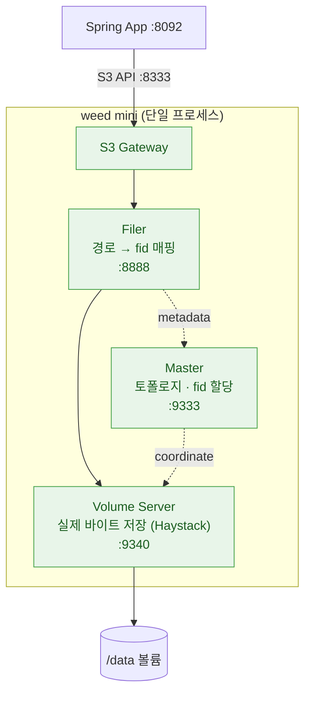
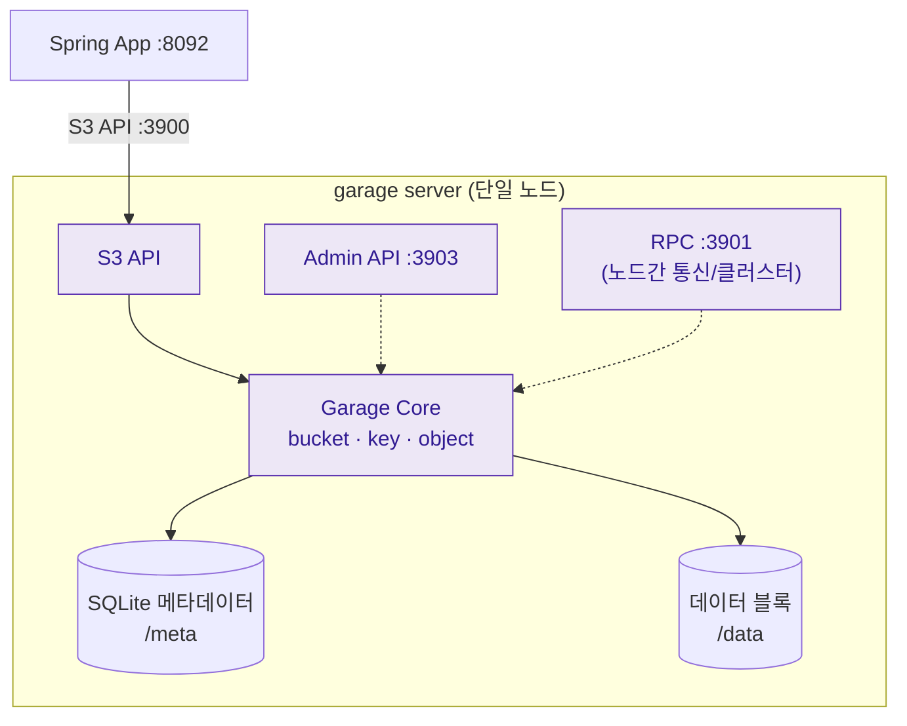
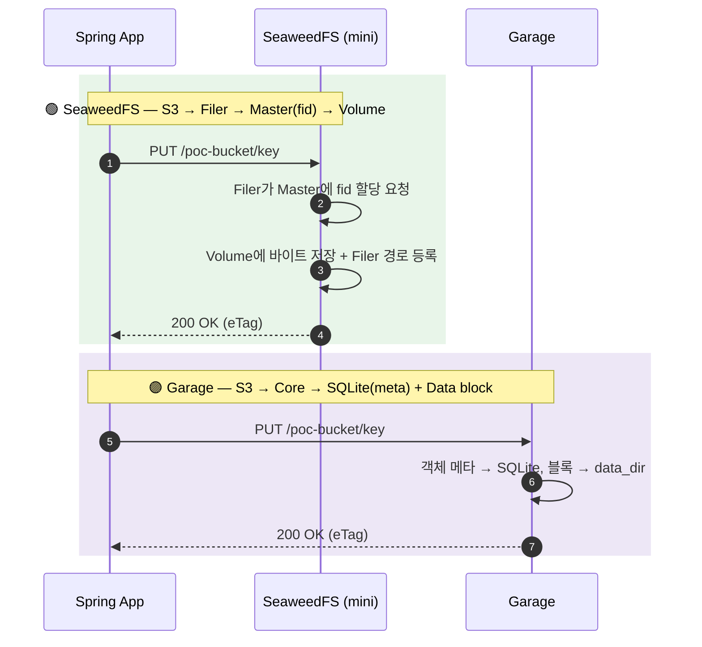
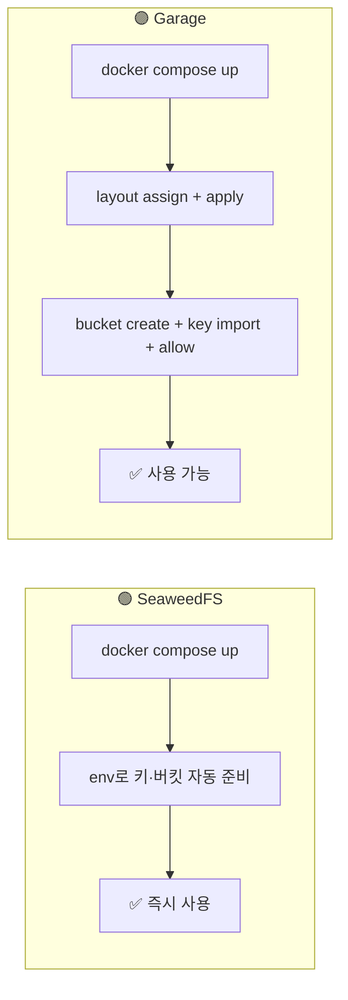
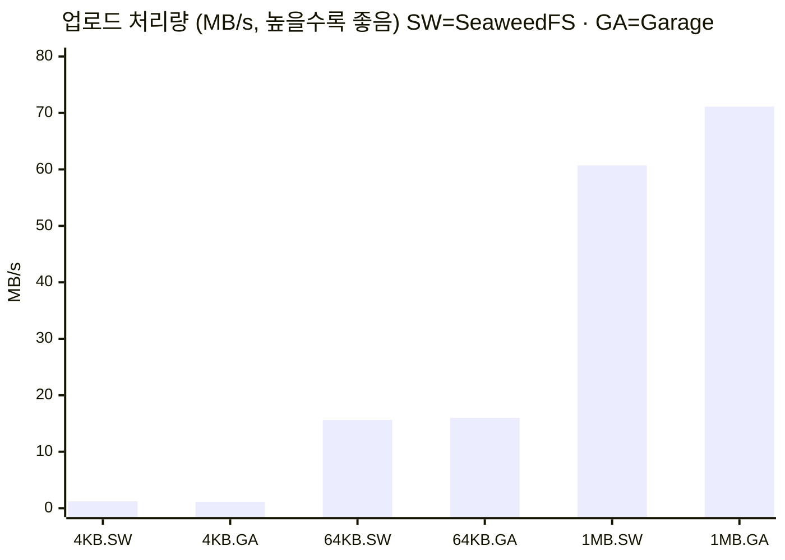
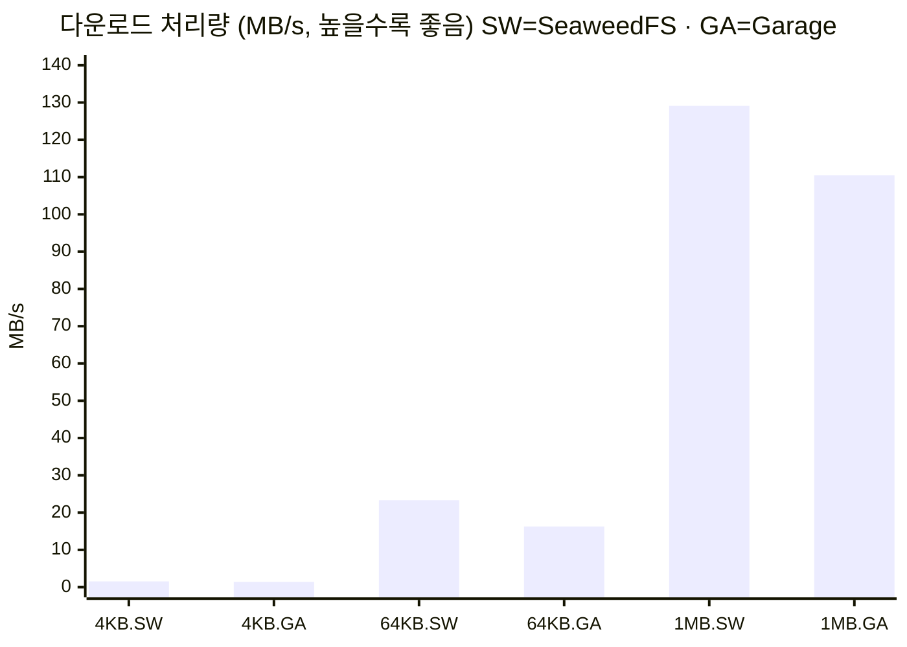
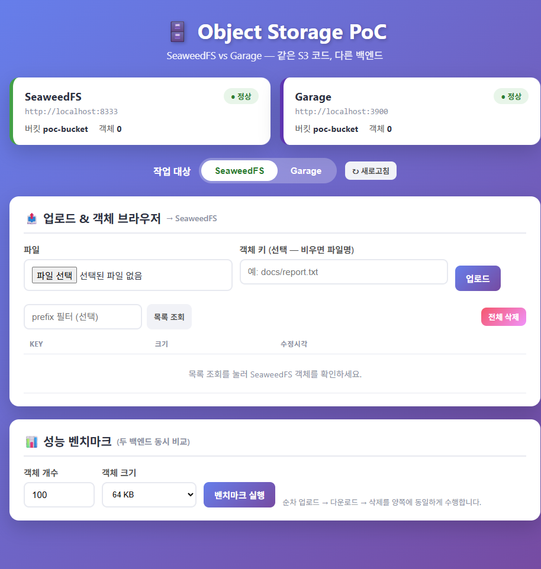
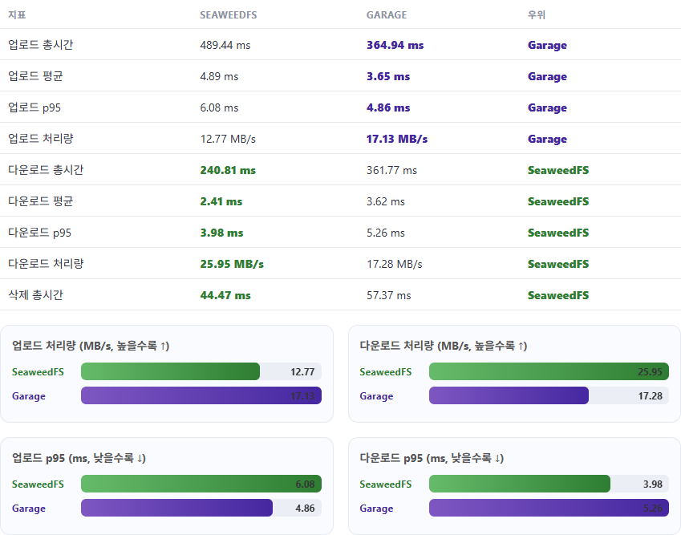
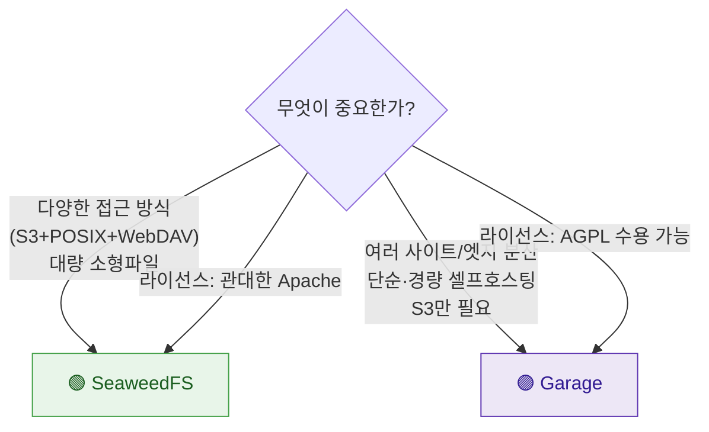

# 🗄️ Object Storage PoC — SeaweedFS vs Garage

S3 호환 오브젝트 스토리지 두 가지를 로컬 Docker로 띄우고, **같은 Spring Boot 코드로 양쪽을 호출**하며 동작·성능을 비교한 학습 리포트.


---

## 📑 목차

1. [한눈에 보기 (TL;DR)](#-한눈에-보기-tldr)
2. [아키텍처 비교](#️-아키텍처-비교)
3. [업로드 데이터 흐름](#-업로드-데이터-흐름)
4. [기능 비교 매트릭스](#-기능-비교-매트릭스)
5. [자격증명 · 버킷 모델](#-자격증명--버킷-모델)
6. [성능 벤치마크 (실측)](#-성능-벤치마크-실측)
7. [⚠️ 호환성에서 배운 점 (중요)](#️-호환성에서-배운-점-중요)
8. [테스트 UI](#-테스트-ui)
9. [셋업 가이드](#-셋업-가이드)
10. [결론 — 언제 무엇을 고를까](#-결론--언제-무엇을-고를까)

---

## 🎯 한눈에 보기 (TL;DR)

|  | 🟢 **SeaweedFS** | 🟣 **Garage** |
|---|---|---|
| 한 줄 정의 | 대량 소형파일에 강한 **다기능** 분산 스토리지 | 지리분산·셀프호스팅용 **경량** S3 스토리지 |
| 구현 / 라이선스 | Go / Apache-2.0 | Rust / AGPL-3.0 |
| 구성 난이도 | 컴포넌트 다수 → `mini` 모드로 단순화 | 단일 바이너리 + **layout 부트스트랩 1회** |
| 인터페이스 | S3 · Filer · POSIX(FUSE) · WebDAV · HDFS | **S3 전용** (+ 정적 웹) |
| 이번 PoC 성능 경향 | **다운로드(읽기) 우위**, 소형 객체 우위 | **대형 객체 업로드 우위** |
| 손이 덜 가는 쪽 | 버킷 자동생성(env) | layout/키 부트스트랩 필요 |

> **핵심 교훈**: 두 백엔드 모두 S3 호환이라 **애플리케이션 코드는 단 한 줄도 다르지 않다.** `endpoint`·`region`·`credentials`만 바꾸면 동일한 `S3Client` 코드가 그대로 돈다. 단, AWS SDK v2의 기본 체크섬 동작 때문에 Garage에서 업로드가 깨지는 함정이 있었다 → [호환성 섹션](#️-호환성에서-배운-점-중요) 참고.

---

## 🏗️ 아키텍처 비교

### 🟢 SeaweedFS — `weed mini` (올인원 단일 프로세스)

회사 PWM 인프라와 동일하게 `mini` 모드로 Master·Volume·Filer·S3를 한 프로세스에 띄웠다. 내부적으로는 **Haystack** 기반의 계층 구조다.



- **버킷** = Filer의 디렉터리(`/buckets/<bucket>`). S3 객체는 경로→fid로 매핑되어 Volume에 저장.
- 컴포넌트가 많지만 `mini`가 이를 하나로 묶어 단일 노드 운영을 단순화.

### 🟣 Garage — `garage server` (대칭 단일 노드)

중앙 마스터가 없는 **대칭(symmetric) 노드** 구조. 단일 바이너리가 S3·RPC·Admin을 모두 제공하고, 메타데이터는 내장 KV(SQLite)에 저장.



- 노드를 **layout**(zone + capacity)에 배정해야 비로소 데이터를 받는다 → 부트스트랩 1회 필요.
- 멀티노드로 확장 시 같은 바이너리를 여러 대 띄워 zone-aware 복제(`replication_factor`)를 구성.

---

## 🔄 업로드 데이터 흐름

같은 `s3.putObject(...)` 호출이지만 내부 경로는 다르다.



---

## 📊 기능 비교 매트릭스

| 항목 | 🟢 SeaweedFS | 🟣 Garage |
|---|---|---|
| 개발 주체 | chrislusf 외 커뮤니티 | Deuxfleurs |
| 구현 언어 | **Go** | **Rust** |
| 라이선스 | Apache-2.0 (관대) | AGPL-3.0 (강한 카피레프트) |
| 저장 모델 | Haystack 기반 Volume + Filer 메타 | Dynamo 스타일 분산 KV + 블록 |
| 메타데이터 저장소 | Filer 백엔드 선택 (leveldb/redis/mysql/postgres…) | 내장 KV (`sqlite` / `lmdb`) |
| 일관성 | 강한 일관성(파일러 기준) | CRDT 기반 — 단일 노드에선 read-after-write, 다중 노드는 결과적 일관성 |
| 복제 | replication 코드(`000`~`xyz`) + Erasure Coding | `replication_factor`(1/2/3) + **zone 인식** |
| S3 핵심 API | PUT/GET/LIST/DELETE ✅ | PUT/GET/LIST/DELETE ✅ |
| Presigned URL | ✅ | ✅ |
| Multipart Upload | ✅ | ✅ |
| 부가 인터페이스 | **Filer API · POSIX(FUSE) · WebDAV · HDFS** | S3 + 정적 웹 호스팅 |
| 주소 방식 | path-style(필수) · vhost | path-style · vhost(`root_domain` 설정 시) |
| 멀티테넌시 | `identities`(s3.json) · IAM · STS | **key + bucket alias**, 키별 RWO 권한 |
| Admin/관측 | 내장 Admin UI(:23646), Master UI(:9333), metrics | Admin API(:3903), CLI, metrics |
| 단일 노드 운영 난이도 | 🟢 쉬움 (`mini`, 버킷 env 자동생성) | 🟡 보통 (layout 배정 + 키 발급 1회) |
| 두드러진 강점 | 대량 소형파일, 다양한 접근 인터페이스 | 지리분산/엣지, 경량·단순, 셀프호스팅 친화 |

> 일관성·복제·HA 관련 항목은 **다중 노드**에서 의미가 커진다. 이번 PoC는 양쪽 모두 단일 노드라 실질적으로 강한 일관성으로 동작했다.

---

## 🔑 자격증명 · 버킷 모델

가장 큰 운영 차이는 "처음 쓸 준비"를 하는 방식이다.

| | 🟢 SeaweedFS | 🟣 Garage |
|---|---|---|
| 자격증명 주입 | 컨테이너 **환경변수** `AWS_ACCESS_KEY_ID/SECRET` | 기동 후 `garage key import/create` |
| 버킷 생성 | `S3_BUCKET` env → **기동 시 자동(멱등)** | `garage bucket create` + `bucket allow` 수동 |
| 권한 모델 | identity별 actions(Admin/Read/Write/List…) | key별 버킷 권한 **R / W / O** |
| 결과 | 컨테이너만 뜨면 바로 S3 사용 가능 | **layout 배정**까지 끝나야 객체 저장 가능 |



이 PoC에서는 Garage 부트스트랩을 멱등 스크립트(`garage-init.ps1`)로 자동화해 한 번에 처리했다.

---

## 🚀 성능 벤치마크 (실측)

### 측정 방법

- 한 백엔드에 **N개 업로드 → N개 다운로드 → 일괄 삭제**를 순차(single-thread)로 수행하며 각 작업 시간을 기록.
- 측정 환경: 동일 머신의 로컬 Docker (Windows 11, localhost). 네트워크 지연이 거의 없으므로 **절대치보다 "같은 조건의 상대 비교"**에 의미가 있다.
- 처리량(MB/s) = 전송 총량 ÷ 구간 총시간. p95는 nearest-rank.

> 순차 측정이라 동시성/대규모 부하 특성은 반영하지 않는다. 어디까지나 학습용 상대 비교다.

### 시나리오별 결과

#### S1 — 소형 4 KB × 200개 (메타데이터 부하 큼)

| 지표 | 🟢 SeaweedFS | 🟣 Garage | 우위 |
|---|---|---|---|
| 업로드 총시간 | **642.4 ms** | 690.6 ms | 🟢 |
| 업로드 p95 | **4.73 ms** | 5.21 ms | 🟢 |
| 다운로드 총시간 | **502.5 ms** | 551.3 ms | 🟢 |
| 다운로드 p95 | 4.89 ms | **4.25 ms** | 🟣 |
| 다운로드 처리량 | **1.55 MB/s** | 1.42 MB/s | 🟢 |
| 삭제 총시간 | **124.2 ms** | 139.5 ms | 🟢 |

#### S2 — 소형 64 KB × 100개

| 지표 | 🟢 SeaweedFS | 🟣 Garage | 우위 |
|---|---|---|---|
| 업로드 총시간 | 400.1 ms | **390.2 ms** | 🟣 |
| 업로드 처리량 | 15.62 MB/s | **16.02 MB/s** | 🟣 |
| 다운로드 총시간 | **268.2 ms** | 383.9 ms | 🟢 |
| 다운로드 p95 | **5.19 ms** | 5.93 ms | 🟢 |
| **다운로드 처리량** | **23.30 MB/s** | 16.28 MB/s | 🟢 |
| 삭제 총시간 | **50.0 ms** | 56.2 ms | 🟢 |

#### S3 — 중형 1 MB × 50개

| 지표 | 🟢 SeaweedFS | 🟣 Garage | 우위 |
|---|---|---|---|
| 업로드 총시간 | 823.6 ms | **703.1 ms** | 🟣 |
| **업로드 처리량** | 60.71 MB/s | **71.12 MB/s** | 🟣 |
| 업로드 p95 | 19.47 ms | **16.75 ms** | 🟣 |
| 다운로드 총시간 | **387.3 ms** | 452.7 ms | 🟢 |
| **다운로드 처리량** | **129.11 MB/s** | 110.45 MB/s | 🟢 |
| 삭제 총시간 | **28.1 ms** | 29.4 ms | 🟢 |

### 처리량 비교 차트

각 시나리오를 `SW`(SeaweedFS)·`GA`(Garage) 쌍으로 나란히 표시한다(막대가 높을수록 빠름).





### 해석

- 🟢 **SeaweedFS는 다운로드(읽기)에서 일관되게 빨랐다.** 특히 64KB·1MB 다운로드 처리량이 뚜렷하게 높다(23.3 vs 16.3, 129 vs 110 MB/s). 소형 객체가 많은 S1에서도 전반적으로 근소 우위.
- 🟣 **Garage는 객체가 커질수록 업로드에서 앞섰다.** 1MB 업로드 처리량 71 vs 61 MB/s. 쓰기 경로가 단순(메타→SQLite, 블록→파일)한 이점으로 보인다.
- 두 백엔드의 차이는 대체로 **10~30% 내외로 크지 않다.** 단일 노드/로컬 기준이므로, 실제 선택은 성능보다 [기능·운영 특성](#-기능-비교-매트릭스)이 좌우한다.

---

## ⚠️ 호환성에서 배운 점 (중요)

이 PoC에서 가장 값진 발견. **같은 코드인데 Garage 업로드만 500 에러**가 났다.

```
software.amazon.awssdk.services.s3.model.InvalidRequestException:
    Bad request: Invalid payload signature (Service: S3, Status Code: 400)
```

- **원인**: AWS SDK for Java v2(2.30+)는 기본으로 **CRC32 flexible checksum**을 켜고, 본문을 `aws-chunked`로 인코딩해 페이로드를 서명한다. SeaweedFS는 이를 관대하게 받아줬지만, **Garage는 이 페이로드 서명을 거부**했다.
- **해결**: 클라이언트에서 체크섬 계산을 `WHEN_REQUIRED`로 낮춰 일반 서명 PUT으로 되돌린다.

```java
S3Client.builder()
    .endpointOverride(URI.create(endpoint))
    .region(Region.of(region))
    .credentialsProvider(/* ... */)
    .forcePathStyle(true)                                  // ① 두 백엔드 모두 path-style 필수
    .requestChecksumCalculation(RequestChecksumCalculation.WHEN_REQUIRED)   // ② Garage 호환
    .responseChecksumValidation(ResponseChecksumValidation.WHEN_REQUIRED)   // ②
    .build();
```

> **교훈**: "S3 호환"이라도 SDK 버전이 바뀌면(특히 v2.30+ 체크섬 기본값) 서드파티 스토리지에서 깨질 수 있다. 비-AWS S3를 쓸 땐 `forcePathStyle(true)` + 체크섬 `WHEN_REQUIRED`를 기본 점검 항목으로 두자.

---

## 🖥️ 테스트 UI

`http://localhost:8092` — 백엔드를 토글하며 업로드/목록/다운로드/삭제와 벤치마크를 한 화면에서 실행한다.

### 대시보드 (상태 배지 · 백엔드 토글 · 객체 브라우저)



### 벤치마크 (양쪽 동시 비교 — 표 + 막대그래프)



위 UI 실행은 별도 1회 측정값이라 위 표(시나리오 측정)와 수치가 약간 다르다(실행 간 변동). **패턴은 동일**: 업로드는 Garage, 다운로드는 SeaweedFS 우위.

---

## 🛠️ 셋업 가이드

### 1) 두 스토리지 기동 + Garage 부트스트랩

```powershell
# object-storage/scripts
./up.ps1
#  - docker compose up -d  (SeaweedFS + Garage)
#  - garage-init.ps1       (layout 배정 → bucket 생성 → key import → 권한 부여, 멱등)
```

### 2) 앱 실행

```powershell
cd object-storage
./gradlew bootRun
# → http://localhost:8092
```

### 3) 엔드포인트

| 대상 | URL |
|---|---|
| 앱 UI | http://localhost:8092 |
| SeaweedFS S3 | http://localhost:8333 |
| SeaweedFS Master UI | http://localhost:9333 |
| SeaweedFS Admin UI | http://localhost:23646 |
| Garage S3 | http://localhost:3900 |
| Garage Admin API | http://localhost:3903 |

### 4) 정리

```powershell
./scripts/down.ps1          # 정지(데이터 유지)
./scripts/down.ps1 -Reset   # 정지 + 볼륨 삭제(초기화)
```

### REST API 빠른 참조 (`{backend}` = `seaweedfs` | `garage`)

```
POST   /api/{backend}/files            multipart 'file' (+선택 'key')   업로드
GET    /api/{backend}/files?prefix=     목록
GET    /api/{backend}/files/content?key= 다운로드
DELETE /api/{backend}/files?key=         단일 삭제
DELETE /api/{backend}/files/all          일괄 삭제
GET    /api/backends                     두 백엔드 상태
POST   /api/benchmark  {count,size}      양쪽 벤치마크
```

---

## 🏁 결론 — 언제 무엇을 고를까



- **SeaweedFS** — 대규모 파일·혼합 워크로드, S3 외 다양한 인터페이스가 필요하거나, Apache-2.0의 관대한 라이선스가 중요할 때. 이번 측정에선 읽기 성능이 좋았다.
- **Garage** — 지리적으로 분산된 여러 노드, 가볍고 단순한 셀프호스팅 S3가 목표일 때. 단일 바이너리 + zone 인식 복제가 강점이며, 대형 객체 쓰기가 빨랐다. (AGPL-3.0 수용 필요)
- **공통** — 애플리케이션은 어느 쪽이든 동일한 S3 코드로 동작한다. 백엔드 전환 비용이 거의 없다는 것이 S3 호환 스토리지의 진짜 가치다.

---

<sub>측정일: 2026-06-17 · 환경: Windows 11 로컬 Docker · SeaweedFS 4.34 / Garage v2.3.0 / Spring Boot 3.5.15 · AWS SDK v2.46.9 (path-style, checksum WHEN_REQUIRED)</sub>
