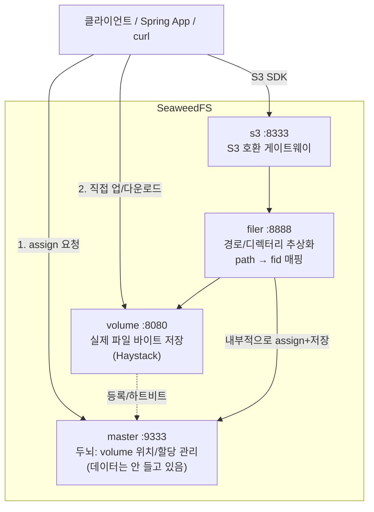
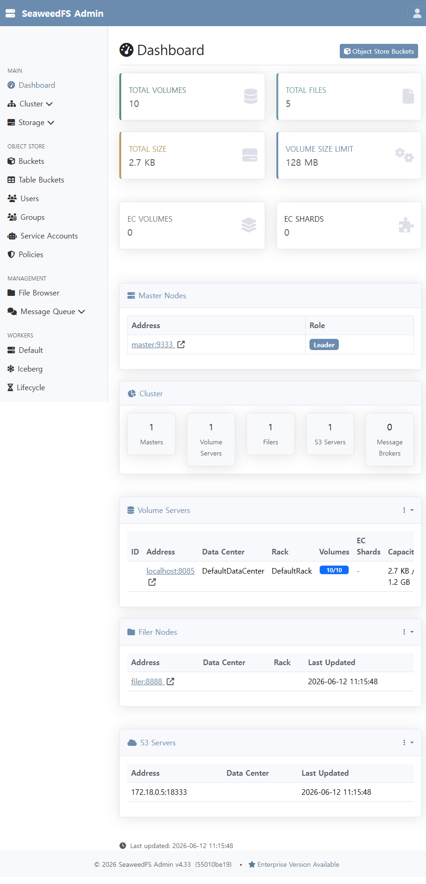
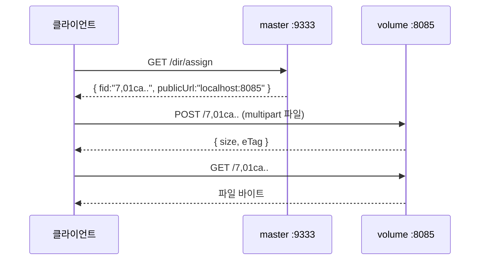

# SeaweedFS POC — A to Z

분산 파일 스토리지 **SeaweedFS**를 로컬에서 직접 띄워 보고, 두 가지 방식으로 다뤄 보는 학습용 POC.

- **Phase 1** — 네이티브 HTTP API 로 바닥 동작 원리(Haystack 모델) 체감
- **Phase 2** — Spring Boot + AWS S3 SDK 로 실무형 S3 호환 사용

> 환경: Windows 11 / Docker Desktop / Java 21 / PowerShell. 이 POC는 실제로 위 환경에서 끝까지 실행·검증되었다.

### 구성 두 가지 — 학습용(분리) vs 실사용(올인원)

| | `docker-compose.yml` (분리) | `docker-compose.allinone.yml` (올인원) |
|---|---|---|
| 컨테이너 | master/volume/filer/s3 (+admin) 분리 | `seaweedfs` **1개** (`weed server -s3`) |
| 목적 | **아키텍처 학습** — 역할을 눈으로 봄 | **실사용** — 작은 파일 + 한 대 + 낮은 트래픽 |
| 네트워킹 | `-ip`/`-publicUrl` 트릭 필요 | 트릭 없음 (전부 localhost, 포트 1:1) |
| volume 포트 | 8085→8080 (8080 충돌 회피) | 8080 그대로 |

**언제 뭘?** 작은 `.dat`/결과 JSON 같은 워크로드를 한 대에서 돌린다면 → **올인원이 정답.** 분리해서 얻는 독립 확장·HA는 한 머신에선 어차피 실현 안 되고 운영 비용만 는다. 분리 버전은 학습용으로만 의미가 있다. (단, 올인원은 HA가 없으니 **결과 데이터는 별도 위치/클라우드로 주기 백업** 필수.)

두 구성은 포트가 겹쳐 **동시 기동 불가** — 하나를 `down` 후 다른 하나를 `up`. 둘 다 같은 `config/s3.json`을 써서 Spring 클라이언트는 코드 변경 없이 양쪽에 그대로 붙는다(검증됨).

---

## 1. SeaweedFS가 뭔가?

작고 빠른 **분산 객체/파일 스토리지**. Facebook의 [Haystack 논문](https://www.usenix.org/legacy/event/osdi10/tech/full_papers/Beaver.pdf)에서 출발했다.

핵심 아이디어: **"작은 파일 수억 개"를 다룰 때 일반 파일시스템은 inode/메타데이터 비용으로 느려진다.** SeaweedFS는 작은 파일 여러 개를 큰 볼륨 파일 하나에 append 하고, 파일 위치를 `volumeId + offset`으로 O(1) 조회한다. 그래서 이미지/썸네일/첨부파일처럼 **작은 파일이 아주 많은** 워크로드에 강하다.

비교 관점:
| | SeaweedFS | MinIO | AWS S3 |
|---|---|---|---|
| 성격 | 자체 스토리지 + S3 호환 게이트웨이 | S3 호환 스토리지 | 매니지드 |
| 강점 | 작은 파일 대량, 단순/경량, filer로 경로 추상화 | S3 100% 호환 초점 | 운영 부담 0 |
| 접근 | 네이티브 API / filer / **S3** / WebDAV / FUSE | S3 | S3 |

---

## 2. 아키텍처

SeaweedFS는 역할이 분리된 여러 프로세스로 동작한다. 이 POC는 학습을 위해 **각 역할을 별도 컨테이너로** 띄운다.



| 컴포넌트 | 역할 | 한 줄 요약 |
|---|---|---|
| **master** | 클러스터의 두뇌 | "어떤 volume이 어디 있는지" 관리하고 쓰기 위치를 할당(assign). **실제 데이터는 안 가짐** → 병목이 안 됨 |
| **volume** | 데이터 저장소 | 실제 파일 바이트를 큰 볼륨 파일에 append 저장 (Haystack) |
| **filer** | 파일시스템 레이어 | `/docs/a.txt` 같은 경로 추상화. 경로 → fid 매핑을 메타 DB에 보관 |
| **s3** | S3 게이트웨이 | filer 앞에 붙는 AWS S3 호환 API. SDK로 접근 |

**레이어링**: `S3 API` → `filer` → `volume`. (이 POC에서 직접 교차검증함 → 5절 참고)

---

## 3. 사전 준비

- **Docker Desktop** 실행 중일 것
- **Java 21** (Spring 클라이언트용. Gradle 래퍼 포함이라 별도 Gradle 설치 불필요)

---

## 4. 빠른 시작 — 클러스터 기동

**실사용(올인원, 추천):**
```powershell
cd D:\backend-tech-lab\seaweedfs-poc
docker compose -f docker-compose.allinone.yml up -d
docker ps --filter name=seaweedfs       # seaweedfs 1개 Up 확인
```

**학습용(분리):**
```powershell
docker compose up -d
docker compose ps          # 4개(+admin) 컨테이너 Up 확인
```

헬스체크 (브라우저/curl):
| URL | 확인 |
|---|---|
| http://localhost:9333/cluster/status | master 리더 상태 |
| http://localhost:9333/dir/status | volume 등록(토폴로지) |
| http://localhost:9333 | master 웹 UI |
| http://localhost:8888 | filer 웹 UI |

### 웹 UI

SeaweedFS는 UI를 제공한다. 두 종류로 나뉜다.

**내장 UI** (각 컴포넌트가 기본 제공):
| UI | URL | 보여주는 것 |
|---|---|---|
| Master | http://localhost:9333 | 클러스터 상태, volume 서버, 토폴로지 |
| Filer | http://localhost:8888 | 파일 브라우저(폴더 탐색·업/다운로드) |
| Volume | http://localhost:8085/ui/index.html | 해당 volume 서버 디스크/볼륨 상태 |

**Admin 대시보드** (`weed admin`, compose의 `admin` 서비스 → http://localhost:23646):
클러스터 개요, 볼륨/EC 관리, 파일 브라우저, S3 사용자·정책·버킷 관리, 유지보수(Lifecycle/Iceberg) 까지 한 화면에서. 가장 본격적인 관리 UI. 로컬 POC라 인증은 비활성(`adminPassword` 비움).



종료 / 완전 초기화:
```powershell
docker compose down        # 컨테이너만 내림 (데이터 유지)
docker compose down -v      # 데이터(named volume)까지 삭제 = 초기화
```

---

## 5. Phase 1 — 네이티브 HTTP API

SeaweedFS의 가장 밑바닥 흐름. **master는 위치만 알려주고, 실제 업/다운로드는 volume에 직접** 한다.

```powershell
powershell -ExecutionPolicy Bypass -File .\scripts\01-native-api.ps1   # volume 직접 (fid 기반)
powershell -ExecutionPolicy Bypass -File .\scripts\02-filer-api.ps1     # filer 경로 기반
```

### 5-A. 네이티브 흐름 (`01-native-api.ps1`)

```
assign(master) → upload(volume) → download(volume) → lookup(master) → delete(volume)
```



- `fid = "7,01caf19d6f"` → 앞 `7` = **volume id**, 뒤 = volume 안에서의 **file key/cookie**
- **호스트(도커 밖)에서는 반드시 `publicUrl`(localhost:8085)로 접근** — `url`(volume:8080)은 도커 네트워크 안에서만 유효 (8절 트러블슈팅 참고)

### 5-B. filer 흐름 (`02-filer-api.ps1`)

fid 대신 **사람이 읽는 경로**로 다룬다. master assign을 직접 할 필요 없이 filer가 다 처리.

```powershell
# 업로드 (경로 지정)
curl.exe -F "file=@a.txt" http://localhost:8888/docs/report.txt
# 목록 (JSON)
curl.exe -H "Accept: application/json" http://localhost:8888/docs/
# 다운로드
curl.exe http://localhost:8888/docs/report.txt
# 메타데이터(경로→fid 매핑 확인)
curl.exe -H "Accept: application/json" "http://localhost:8888/docs/report.txt?metadata=true"
```

`metadata=true`로 보면 경로가 내부적으로 `chunks: [{ file_id: "5,0387.." }]`로 매핑된 걸 볼 수 있다 → **filer 경로 → fid → volume** 레이어링이 눈에 보인다.

---

## 6. Phase 2 — Spring Boot + AWS S3 SDK

`spring-client/` 는 **표준 AWS S3 SDK(v2)** 로 SeaweedFS의 S3 게이트웨이에 붙는 Spring Boot 앱이다.

> 코드는 진짜 AWS S3를 쓸 때와 100% 동일. 운영에서 AWS S3로 갈아타도 [S3Config.java](spring-client/src/main/java/com/example/seaweedpoc/config/S3Config.java)의 `endpoint`만 바꾸면 된다. **이게 S3 호환의 핵심 가치.**

### 실행

```powershell
cd spring-client
.\gradlew.bat bootRun        # http://localhost:8091, 시작 시 poc-bucket 자동 생성
```

### 연결 설정 — 두 가지가 핵심 ([S3Config.java](spring-client/src/main/java/com/example/seaweedpoc/config/S3Config.java))

1. `endpointOverride(http://localhost:8333)` — AWS가 아니라 우리 SeaweedFS를 바라보게
2. `forcePathStyle(true)` — SeaweedFS는 **path-style**(`host/bucket/key`)만 지원. 기본값 virtual-host style(`bucket.host/key`)은 localhost에서 DNS가 안 풀려 실패

### REST API

| 메서드 | 경로 | 설명 |
|---|---|---|
| POST | `/api/files` (multipart `file`, 선택 `key`) | 업로드 |
| GET | `/api/files` (선택 `?prefix=`) | 목록 |
| GET | `/api/files/content?key=` | 다운로드 |
| DELETE | `/api/files?key=` | 삭제 |
| DELETE | `/api/files/all` | 전체 삭제(정리용) |

```powershell
# 업로드
curl.exe -F "file=@a.txt" -F "key=docs/hello.txt" http://localhost:8091/api/files
# 목록 / 다운로드 / 삭제
curl.exe http://localhost:8091/api/files
curl.exe "http://localhost:8091/api/files/content?key=docs/hello.txt"
curl.exe -X DELETE "http://localhost:8091/api/files?key=docs/hello.txt"
```

### 레이어링 교차검증 (직접 확인해 볼 것)

S3로 올린 객체는 **filer의 `/buckets/<bucket>/` 아래에 그대로 저장**된다:
```powershell
curl.exe -H "Accept: application/json" "http://localhost:8888/buckets/poc-bucket/docs/"
# → /buckets/poc-bucket/docs/hello.txt 가 보인다. "S3 버킷 = filer 디렉터리"
```

---

## 7. 포트 정리

| 서비스 | 호스트 포트 | 용도 |
|---|---|---|
| master | 9333 / 19333 | HTTP·UI / gRPC |
| volume | **8085** → 8080 | 파일 직접 업·다운로드 (호스트 8080 충돌로 8085 매핑) |
| filer | 8888 / 18888 | 경로 기반 API·UI / gRPC |
| s3 | 8333 | S3 호환 API |
| admin | 23646 | Admin 대시보드 UI |
| spring-client | 8091 | POC 앱 |

S3 자격증명 (`config/s3.json`): `pocAccessKey` / `pocSecretKey123`, 버킷 `poc-bucket`.

---

## 8. 트러블슈팅 (이 POC에서 실제로 겪은 것들)

- **호스트 8080 포트 충돌** → volume 호스트 포트를 `8085`로 매핑. 이때 `-publicUrl`도 `localhost:8085`로 맞춰야 호스트에서 직접 업로드 가능.
- **`publicUrl` 트릭** → master는 assign 시 `url`(내부: `volume:8080`)과 `publicUrl`(외부: `localhost:8085`)을 함께 준다. 도커 밖 클라이언트는 `publicUrl`을 써야 한다. compose에서 `volume -ip=volume -publicUrl=localhost:8085`로 분리 설정.
- **PowerShell 5.1에서 한글 .ps1 깨짐** → PS 5.1은 BOM 없는 UTF-8을 시스템 코드페이지로 오독한다. 스크립트 파일에 **UTF-8 BOM**을 넣어야 한다. (이 repo의 `scripts/*.ps1`은 BOM 포함)
- **S3 SDK 403 / 연결 실패** → `forcePathStyle(true)` 누락이 가장 흔한 원인. SeaweedFS는 path-style만 지원.

---

## 9. 정리(Cleanup)

```powershell
# Spring 앱 종료: bootRun 콘솔에서 Ctrl+C, 혹은 8091 점유 프로세스 종료
# SeaweedFS 종료
docker compose down        # 데이터 유지
docker compose down -v      # 완전 초기화
```

---

## 10. 더 파볼 것

- **복제(replication)**: assign 시 `?replication=001` 등으로 복제본 수 지정 (volume 여러 대 필요)
- **Erasure Coding**: 콜드 데이터를 EC로 변환해 저장 효율↑
- **filer store 교체**: 기본 임베디드 leveldb → MySQL/Postgres/Redis 등으로 메타데이터 백엔드 변경 (`filer.toml`)
- **TTL**: 업로드 시 만료시간 부여 (`?ttl=3m`)
- **S3 IAM**: `config/s3.json`에서 사용자별 권한(Read/Write/Admin) 분리
- **`weed shell`**: `docker compose exec master weed shell` 로 클러스터 점검 명령 사용

## 디렉터리 구조

```
seaweedfs-poc/
├── docker-compose.yml          # master/volume/filer/s3 4개 컨테이너
├── config/s3.json              # S3 자격증명
├── scripts/
│   ├── 01-native-api.ps1       # Phase 1: volume 직접 (fid)
│   └── 02-filer-api.ps1        # Phase 1: filer 경로
└── spring-client/              # Phase 2: Spring Boot + AWS S3 SDK
    └── src/main/java/com/example/seaweedpoc/
        ├── config/S3Config.java
        └── storage/{S3StorageService,FileController}.java
```
